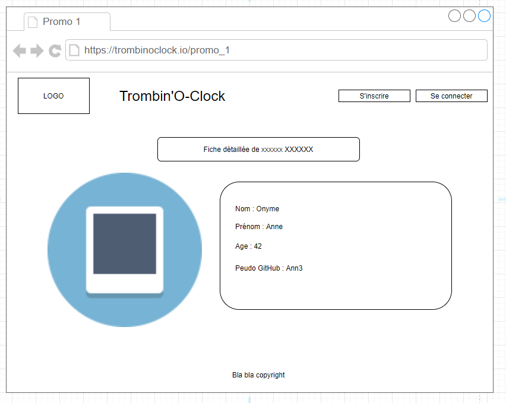

# Challenge E02

## Écrire du SQL
Dans le dossier conception, crée un fichier sql.md. Dans ce fichier, écris les requêtes SQL pour obtenir les informations suivantes :

- toutes les promos, dans l'ordre alphabétique
- tous les étudiants, dans l'ordre alphabétique des noms de famille
- tous les étudiants de la promo 135
- les étudiants dont le nom ou le prénom ressemble à "max"

### Requêtes depuis le serveur
En t'inspirant de ce qui a été fait dans test.js, modifie la méthode `allPromosPage` du promoController pour qu'elle utilise une requête SQL afin d'afficher la liste des promos !

### Bonus
Sur le même principe, modifie la méthode `detailPromoPage`.

Quand tu es sur de toi, supprime les fichiers json du dossier data !

---

# Challenge E01

## Etape 1 : créer le le wireframe manquant

- Utiliser wireframe.cc (ou n'importe quel outil, même papier crayon c'est bien aussi mais difficile à partager) pour créer le wireframe de la **Page de détail d'une promo** (liste des étudiants d'une promo donnée)

## Etape 2 : Implémenter la route /promo/:id

- Déterminer la route pour le détail d'une promo, construire la méthode de controller associée et la vue.

_Astuce :_ Si on veut afficher l'avatar d'un étudiant on peut utiliser l'adresse : https://github.com/[username].png en remplaçant bien sûr le [username] x)

---

# GDP

Gestion De Projet

(ou comment transformer un mail de 5 lignes en dossier de 74 pages...)

## Les différentes étapes

0. Recevoir une appel d'offre, une demande de projet, ...
1. Traduire en "Use cases" : ce sont des petites phrases qui décrivent précisement les fonctionnalités du site/du logiciel.
2. Prioriser et organiser les Use Cases en Sprint : ce sont des ensemble de Use Cases qui représentent une période de travail donnée (souvent 7 ou 15 jours - pour nous, sur ce projet, on va faire des sprints plus courts)
3. Maquettage des visuels (ou "wireframing"). ATTENTION : il ne s'agit pas de définir une charte graphique ou même de faire des choses trop précises. Il s'agit de donner des grandes lignes d'aspect graphiques (structure et organisation des pages).

## Étape 0 : le mail du client

```
Bonjour, nous sommes une école qu'elle est bien, et nous voulons un outil pour faciliter les contacts entre étudiants.
Nous aimerions donc pouvoir lister les promotions ainsi que les étudiants qui les composent, 
mais aussi accèder aux détails d'un étudiant, photo de profil comprise.
L'accès aux profils serait libre et gratuit.
Dans un second temps l'outil pourrait servir à éditer les profils et promotions.

En ésperant que vous pourrez répondre favorablement à notre demande, 
Cordialement
Nicole.
```

## Étape 1 : les Use Cases

Le but : traduire la demande client en petites fonctionnalités, plus facilement implémentable. Surtout, il ne doit pas rester de zones d'ombre !

Le format : tous les Use Cases doivent s'écrire de la manière suivante :
```
En tant que <statut de l'utilisateur>, je veux <action à effectuer> dans le but de <objectif de l'action>.
```


|#|En tant que ... | je veux ... | dans le but de ... |
|---|---|---|---|
|1|Visiteur(*)|accèder à la page d'accueil|voir les fonctionnalités du site|
|2|Visiteur|accèder à la liste des promotions|pouvoir choisir une promotion|
|3|Visiteur|accèder à la page détails d'une promotion|voir les étudiants qui la composent|
|4|Visiteur|accèder à la page détails d'un étudiant| voir les informations de son profil|
|5|Visiteur|accèder à la liste de tous les étudiants|voir tous les étudiants de l'école|
|6|Visiteur|accèder à un formulaire d'inscription| devenir un utilisateur enregistré|
|7|Visiteur|accèder à un formulaire de connexion| devenir un utilisateur connecté|
|8|Utilisateur connecté| pouvoir devenir admin (***) | d'accèder aux pages d'aministration|
|9|Admin(**)|accèder à un formulaire d'édition de promo|modifier les infos d'une promo|
|10|Admin|accèder à un formulaire d'édition de étudiant|modifier les infos d'un étudiant|


(*) Visiteur : un utilisateur qui n'est ni enregistré, ni loggé.  

(**) Admin : un utilisateur enregistré et connecté, et qui a des droits d'accès particulier.  

(***) Le procédé pour devenir admin n'est pas encore déterminé !

## Étape 2 : organisation et priorisation

On utilise un kanban pour visualiser les taches à faire/en cours/terminée.

CF : https://github.com/O-clock-Jason/trombinoclock-RED/projects/1?fullscreen=true

## Étape 3 : Wireframes

Pour réaliser les wireframes (maquettes), on peut utiliser un des outils suivants : 

- app.diagrams.net (anciennement draw.io)
- wireframe.cc
- lucidchart
- figma
- paint
- le bon vieux papier/crayon.
- ...

#### Page d'accueil


#### Liste des promos


#### Page détails d'un étudiant

